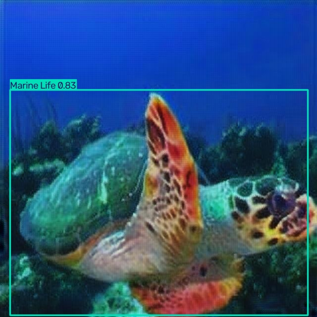
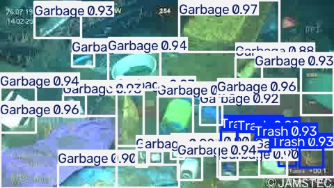

# 水下目标检测系统

基于 YOLO11n 的水下目标检测应用，能够在水下图像中同时识别**海洋生物**（鱼类、海龟等）与**水下垃圾**（塑料、废弃物等），并通过网页 Demo 实时展示检测结果与统计计数。

## 项目亮点

- 端到端完整流程：数据处理 → 云端训练 → 本地推理 → 网页 Demo
- 4 类目标检测：Trash / Other / Garbage / Marine Life
- 1072 张标注图片，覆盖水下垃圾与海洋生物两大场景
- 支持置信度阈值动态调节，实时调整检测灵敏度
- 模型导出 ONNX 格式，具备跨平台部署能力

## 检测效果

基于 Colab 60 轮 GPU 训练的模型，在 108 张测试集上的表现：

| 指标         | 数值       |
| ---------- | -------- |
| mAP\@50    | **0.90** |
| mAP\@50-95 | 0.71     |
| Precision  | 0.90     |
| Recall     | 0.86     |
| 模型大小       | 5.3 MB   |
| CPU 单帧推理   | 74 ms    |

各类别检测表现：

| 类别          | mAP\@50 | Recall | 说明          |
| ----------- | ------- | ------ | ----------- |
| Trash       | 0.995   | 100%   | 垃圾检测极准      |
| Garbage     | 0.977   | 93%    | 多处垃圾检测优秀    |
| Other       | 0.988   | 100%   | 其他类别准确      |
| Marine Life | 0.631   | 49%    | 海洋生物召回率有待提升 |

垃圾类目标检测精度高（mAP > 0.97），海洋生物类召回率偏低，后续可通过增加海洋生物标注数据或调整训练策略优化。

**实际检测效果**：

| 海洋生物检测 | 水下垃圾检测 |
|:---:|:---:|
|  |  |

> 效果图由 `src/make_assets.py` 生成，可随时重新产出。

## Clone 后能拿到什么

Clone 这个仓库后，你**立刻就能跑**，不需要自己训练模型：

| 文件                        | 说明               | 是否包含               |
| ------------------------- | ---------------- | ------------------ |
| `models/best.pt`          | 训练好的模型（5.3 MB）   | 包含，clone 后直接可用     |
| `samples/`                | 5 张样例测试图（155 KB） | 包含，2 张海洋生物 + 3 张垃圾 |
| `src/*.py`                | 三个可运行脚本          | 包含                 |
| `train/` `valid/` `test/` | 完整数据集（1072 张图）   | 不包含，从 Roboflow 下载  |
| `yolo11n.pt`              | 官方预训练权重          | 不包含，首次运行自动下载       |
| `best.onnx`               | ONNX 导出格式        | 不包含，按下方步骤导出        |

**clone 后的三步使用流程**：

```bash
git clone https://github.com/lilifu1519-ux/marine-yolo-project.git
cd marine-yolo-project
conda create -n marine python=3.10 -y && conda activate marine
conda install pytorch torchvision cpuonly -c pytorch
pip install -r requirements.txt
cd src && python app.py
```

浏览器打开 `http://127.0.0.1:7860`，上传 `samples/` 里的图片就能看到检测效果。

## 目录结构

```
marine-yolo-project/
├── data.yaml               # 数据集配置（类别名 + 路径）
├── samples/                # 5 张样例图片（包含在仓库里）
├── src/                     # 可运行脚本
│   ├── test_detect.py       # 用官方模型验证环境是否正常
│   ├── predict_local.py     # 用自训练模型检测本地图片
│   └── app.py               # Gradio 网页 Demo
├── models/                  # 模型文件
│   └── best.pt              # 训练好的模型（包含在仓库里）
├── assets/                  # 检测效果图（README 展示用）
├── requirements.txt         # Python 依赖清单
├── .gitignore
└── README.md
```

> **完整数据集**（train/valid/test 共 1072 张图）体积较大，不放入 Git。需要训练时从 [Roboflow](https://universe.roboflow.com/) 下载，或按下方训练说明自行准备。

## 环境安装

使用 Anaconda 创建独立环境：

```bash
conda create -n marine python=3.10 -y
conda activate marine
conda install pytorch torchvision cpuonly -c pytorch
pip install -r requirements.txt
```

## 快速开始

### 1. 验证环境

```bash
conda activate marine
cd src
python test_detect.py
```

运行后会在 `src/` 下生成 `my_first_detection.jpg`，说明环境正常。

### 2. 检测本地图片

```bash
python predict_local.py
```

自动使用 `samples/` 里的第一张图（有 `test/images/` 时优先用完整测试集），结果保存为 `src/own_result.jpg`。

指定图片：

```bash
python predict_local.py --img D:/Trae/marine-yolo-project/test/images/你的图片.jpg
```

### 3. 启动网页 Demo

```bash
python app.py
```

浏览器打开 `http://127.0.0.1:7860`，上传图片即可看到：

- 检测框与类别标签
- 置信度滑块（调高框变少但更准，调低框变多）
- 目标计数与类别统计

## 数据集

数据集来自 [Roboflow Universe](https://universe.roboflow.com/) 的水下目标检测公开数据集。

| 类别          | ID | 说明          | 标注数量 |
| ----------- | -- | ----------- | ---- |
| Trash       | 0  | 垃圾          | 66   |
| Other       | 1  | 其他          | 16   |
| Garbage     | 2  | 多处垃圾        | 1097 |
| Marine Life | 3  | 海洋生物（鱼、海龟等） | 271  |

数据划分：

| 划分  | 图片数量 |
| --- | ---- |
| 训练集 | 804  |
| 验证集 | 160  |
| 测试集 | 108  |
| 合计  | 1072 |

## 训练说明

### 本地冒烟训练（验证流程）

```bash
yolo train model=yolo11n.pt data=data.yaml epochs=20 imgsz=640 batch=8 device=cpu
```

### 正式训练（Google Colab GPU）

```bash
yolo train model=yolo11n.pt data=data.yaml epochs=60 imgsz=640 device=0
```

训练完成后将 `best.pt` 下载到本地 `models/` 目录。

### 评估指标

打开 `runs/detect/runs/smoke/` 文件夹查看：

| 文件                     | 内容             |
| ---------------------- | -------------- |
| `results.csv`          | 每轮 mAP 变化      |
| `BoxPR_curve.png`      | PR 曲线（越往右上角越好） |
| `confusion_matrix.png` | 混淆矩阵（对角线越深越准）  |

## 模型导出

将 PyTorch 模型导出为 ONNX 通用格式，方便跨平台部署：

```bash
yolo export model=models/best.pt format=onnx imgsz=640 simplify=True device=cpu
```

导出后在 `models/` 下生成 `best.onnx`。

## 技术栈

| 组件           | 说明                  |
| ------------ | ------------------- |
| YOLO11n      | 目标检测模型（Ultralytics） |
| PyTorch      | 深度学习框架（CPU 版）       |
| Gradio       | 网页 Demo 界面          |
| ONNX         | 模型通用导出格式            |
| Anaconda     | 环境隔离与管理             |
| Google Colab | 免费云端 GPU 训练         |
| Roboflow     | 数据集来源               |

## 项目流程

1. **数据准备**：从 Roboflow 下载水下目标检测数据集，1072 张标注图片
2. **环境搭建**：Anaconda 创建独立环境，安装 PyTorch + Ultralytics
3. **本地冒烟训练**：20 轮 CPU 训练验证完整流程（mAP\@50 = 0.87）
4. **云端正式训练**：Colab GPU 60 轮训练，获得最终模型
5. **本地推理部署**：模型下载到本地，CPU 运行检测
6. **网页 Demo**：Gradio 搭建交互式检测界面
7. **模型导出**：导出 ONNX 格式，具备跨平台能力

